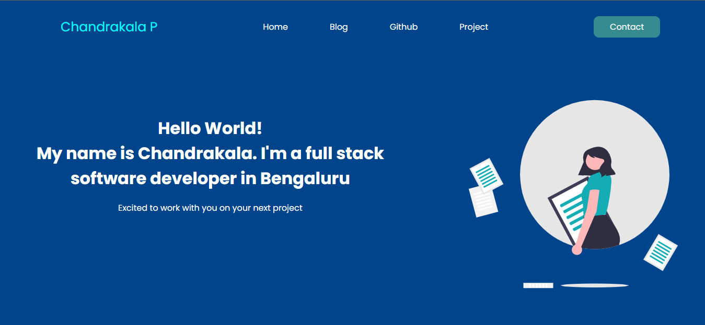

# Project 15:Portfolio using HTML  and CSS 

Chandrakala P

## Final Look of the Webpage:

## Stacks and Tools:

- HTML and CSS
- HTML : list, p, div, li, ul, ol, heading tags, button, img, and many more.
- CSS: margin, padding, bgc, color, posiiton text-decorations align items, display, flex, text align, justify content, gap, bgi, border, border-radius, transform, grid, flex-box, box-shadow etc.

## It took around 5 hrs.
